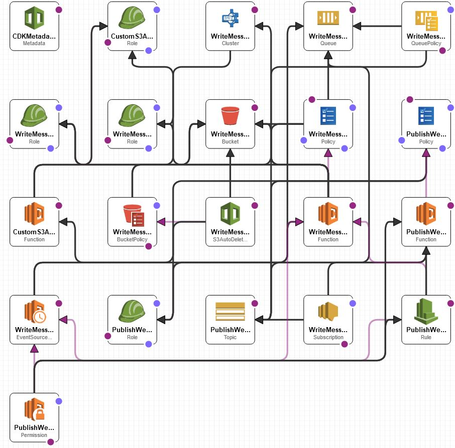
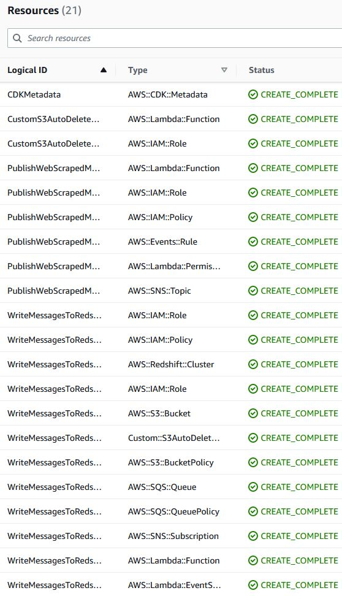

# Welcome to Web Scraping Data Pipeline!

Suppose you are ingesting large amounts of data for ad hoc analysis on a SQL data warehouse, you got big data! For Data Engineering, there are the 3 Vs: volume, velocity, variety. AWS Redshift is a suitable data warehouse for volume (massive scalability), sufficiently good velocity, and variety (can deal with JSON columns via `super`).


# Architecture
<p align="center"></p>
The architecture diagram looks quick intense. The core idea is quite simple: there is the service publishing data to a SNS topic (emulating the web scraping) and there is a service that uploads data to the Redshift data warehouse. Here are the moving parts:

* Every 1 minute, Eventbridge triggers a Lambda to load `telegram.csv` from `data-engineering-bezant-assignement-dataset.zip` in pandas DataFrame, randomly selects between 1 to 1000 rows, and publishes that data to a SNS topic. The purpose is to emulate the publishing of web scraped messages in a way that allows fan-out to multiple subscribers/consumers.
* There is currently 1 subscriber, which is a SQS queue that triggers a Lambda. The Lambda writes the data (representing web scraped messages) to a S3 bucket, calls the Redshift API via `boto3` such that Redshift loads that S3 file to a table, and then the Lambda renames that S3 file where the bucket policy will expire and delete that file after 1 day. The retention of the S3 file (instead of immediate deletion) is for debugging if something anomalous happens; you can look into the S3 file and cross reference if that data was successfully loaded in to Redshift.
* For observability, you can inspect the Lambda's Cloudwatch logs: runtime duration, failures, etc. If you are fancy, you can add metrics & alarms to the Lambda (and API Gateway). For the business/operations/SRE team, you can add New Relic to the Lambda such that there will be "single pane of glass" for 24/7 monitoring.


## Miscellaneous details:
* `cdk.json` is basically the config file. I specified to deploy this microservice to us-east-1 (Virginia). You can change this to your region of choice.
* The following is the AWS resources deployed by CDK and thus Cloudformation. A summary would be: <p align="center"></p>
    * 1 Eventbridge rule
    * 2 Lambda functions
    * 1 SNS topic
    * 1 SQS queue
    * 1 S3 bucket
    * 1 Redshift cluster
    * other miscellaneous AWS resources such as IAM permissions
* As always, IAM permissions and VPC security groups are the trickiest parts.
* In production, I would have a DLQ for the SQS queue such that failed messages are not reprocessed forever. Also I would add monitoring metrics everywhere to inform me when something breaks.


# Learnings
There were certain challenges with the data. For example, the `reply_message_id` column is supposed to be an integer but my Redshift table defined it as a float. The reason is that pandas saw NULLs in that column and thus cast it to float. Also `message_timestamp` and `processing_time` are timestamps, but I defined the table columns as VARCHAR for expendiency's sake. `message_content` had a large spread on the length of the message; there were many "messages" that had 0 length. The largest message had over 4,000 characters, so I arbitrarily defined the table column to be VARCHAR(5000). In the case of a message larger than that, my Lambda would fail to run. A simple fix is to truncate the message to 5000 characters. Another possibility is to wait and see for the failures such as in a try/except construct and print out the failing message.
Since storage is cheap, you can consider retaining all the web scraped data and save it to files in S3 Glacier or S3 Intelligent tiering rather than deleting the data. 1 GB costs about 1 cent per month on S3 Infrequent access, so 100 GB is $1/month. 1 Terabyte is $10/month.

Given more time, I would have opted to go full serverless. The only "server-ful" component of my architecture is the Redshift cluster. However Redshift also offers the serverless variant. Hence this architecture can be modified to be entirely serverless, pay-as-you-go instead of pay-for-being-turned on.

To integrate with a full ML learning system, I would give the quant/data scientist an AWS Sagemaker notebook instance where he can pull data from Redshift and run ad hoc queries and test hypotheses. If he is building ML models, then he can deploy to a Sagemaker endpoint where he can do rapid real-time inferences or bulk/batch inferencing. This architecture implements the OLAP database. If you also want the OLTP database (such as RDS/DynamoDB/insert_your_favorite_database), then simply attach another subscriber to the SNS topic. Then each subscriber can parallelize data ingest to its respective database.


# Deploying the Microservice Yourself
```
$ python -m venv .venv
$ source .venv/bin/activate
$ python -m pip install -r requirements.txt
$ cdk deploy  # Docker daemon must be running; also assumes AWS CLI is configured + npm installed with `aws-cdk`: detailed instructions at https://cdkworkshop.com/15-prerequisites.html
```